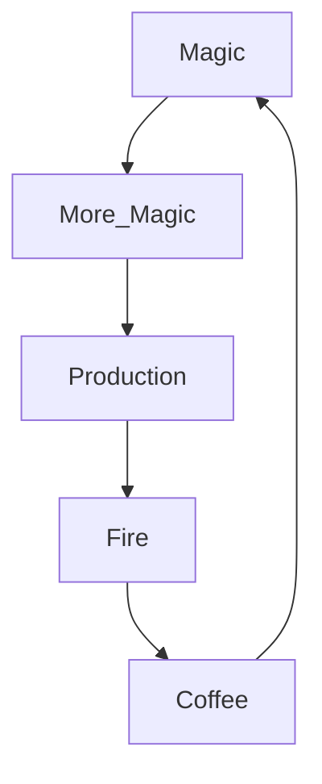

# 🕵️‍♂️ classified_project_gamma_v4.exe 🕵️‍♀️

  

 

> **WARNING:** UNAUTHORIZED ACCESS DETECTED. 
> 
> *Just kidding, we know you're here. We always know.* 👁️👄👁️

---

### Are you a developer?
If you are reading this, you either:
1. Actually know how to use Git (congrats, you're a wizard 🧙‍♂️).
2. Clicked the wrong button and are now trapped in the Matrix. (Take the blue pill).

---

### 🎮 The "I definitely know what I'm doing" Checklist
- [x] Pretend to read the docs
- [ ] Copy-paste the first command you see
- [ ] Blame the compiler when it breaks
- [ ] ???
- [ ] Profit 

<b> DO NOT CLICK THIS. I REPEAT. DO NOT. </b>

 

#  BOOM! 
You did it anyway. You absolute rebel. The audacity! The sheer reckless disregard for rules! 

Since you're here, have a cookie: 

<i>Wait, there's more?</i>

 

(ﾉ◕ヮ◕)ﾉ*:･ﾟ✧ **MAGIC SPARKLES** ✧ﾟ･: *ヽ(◕ヮ◕ヽ)

You have found the super-secret inner sanctum of the README!
Here is a very important, highly technical diagram of our core architecture:

---

### 👾 Secret Terminal Hack

To unlock the mainframe, stare at this text until it makes sense:

`01100010 01101111 01101111 01110000` (it says *boop*)

 

  Psst. Hey you. Down here. Yeah, you. This project is powered by caffeine, late nights, and a healthy dose of imposter syndrome. Don't tell the boss. 

